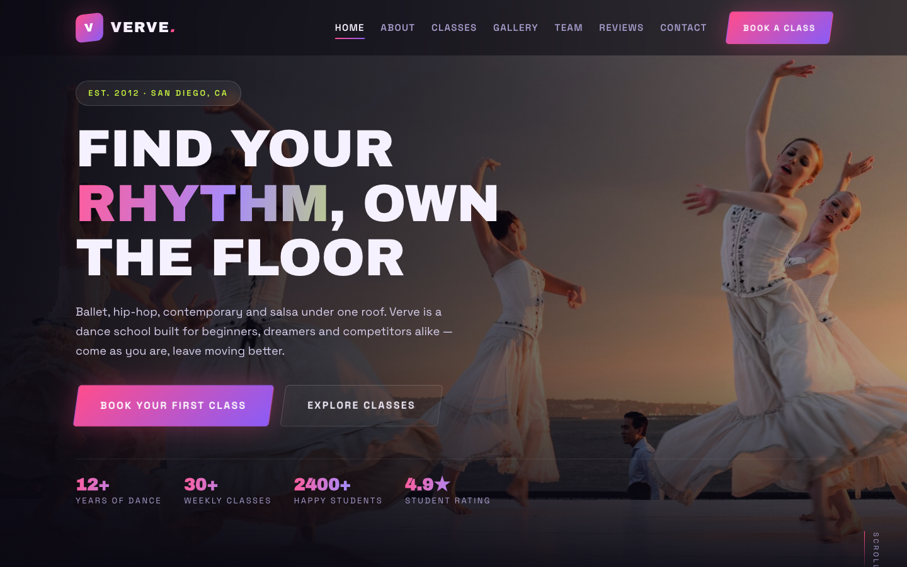

# Verve Dance Studio — Ballet, Hip-Hop, Contemporary &amp; Salsa

A bold, premium HTML template for a movement-first dance studio. Neon-pink and violet gradients collide with a near-black ground, driven by Archivo Black display type and Space Grotesk body text — an electric, energy-charged home for ballet, hip-hop, contemporary and salsa classes.

## 📸 Screenshot

## Design System

| Token | Value |
|-------|-------|
| **Ground** | `--bg` `#0b0913` (near-black plum), `--surface` `#14101f` |
| **Accent gradient** | `--grad` `linear-gradient(135deg,#ff4d8d 0%,#8b5cf6 100%)` |
| **Signal colors** | `--pink` `#ff4d8d`, `--violet` `#8b5cf6`, `--lime` `#c8f542`, `--teal` `#38e0a8`, `--gold` `#ffd166` |
| **Text** | `--ink` `#f7f3ff` on dark, `--muted` `#a99fbf` |
| **Display type** | `Archivo Black` (single-weight, poster) |
| **Body type** | `Space Grotesk` (sans, 400–700) |
| **Container** | 1200px max-width, centered |
| **Breakpoints** | ~980px (tablet), ~720px (mobile) |

## Pages

| Page | File | Description |
|------|------|-------------|
| Home | [index.html](index.html) | Hero, class teasers, counters, schedule preview, reviews, CTA band |
| About | [about.html](about.html) | Studio story, values, stats, teacher lineup |
| Classes | [service.html](service.html) | Six styles with weekly schedule table and booking CTAs |
| Gallery | [gallery.html](gallery.html) | Masonry-style grid of studio and class photography |
| Team | [team.html](team.html) | Instructor grid with specialties |
| Reviews | [testimonial.html](testimonial.html) | Five-star student testimonials |
| Contact | [contact.html](contact.html) | Booking form with `[data-form]` validation and studio info cards |
| 404 | [404.html](404.html) | On-brand lost-page with recovery links |

## Features

- **Framework-free** — pure HTML5, CSS3 (custom properties, Grid, Flexbox, `clamp()`), vanilla JavaScript
- **Neon-on-dark aesthetic** — pink-to-violet gradient accents on a near-black plum ground
- **Fluid responsive** — no horizontal scroll on any viewport, mobile-first collapse
- **Scroll reveal** — IntersectionObserver-powered `.reveal` animations (respects `prefers-reduced-motion`)
- **Mobile nav** — burger toggle with `aria-expanded` accessible pattern
- **Animated counters** — `[data-count]` stats that count up on scroll into view
- **Form validation** — `[data-form]` hook with `.form-ok` / `.form-err` / `.show` toggle
- **Gradient text** — `.grad-text` background-clip headline accents
- **Original imagery** — production-quality dance photography, no placeholders

## Tech Stack

- HTML5 + CSS3 (W3C-valid, semantic landmarks)
- Vanilla JavaScript (canonical IIFE build)
- Google Fonts (Archivo Black + Space Grotesk)
- SVG favicon (inline data: URI)

## SEO

- Semantic HTML5 structure (`<header>`, `<nav>`, `<main>`, `<section>`, `<footer>`)
- Unique `<title>` and `<meta description>` per page
- `lang="en"` attribute, `charset="utf-8"`, viewport meta
- Alt text on all images

## License

Free for personal and commercial use. Attribution appreciated but not required.

---

## Let's Build Something Together 🚀

[Book a free consultation](https://tally.so/r/q4q1L9)
